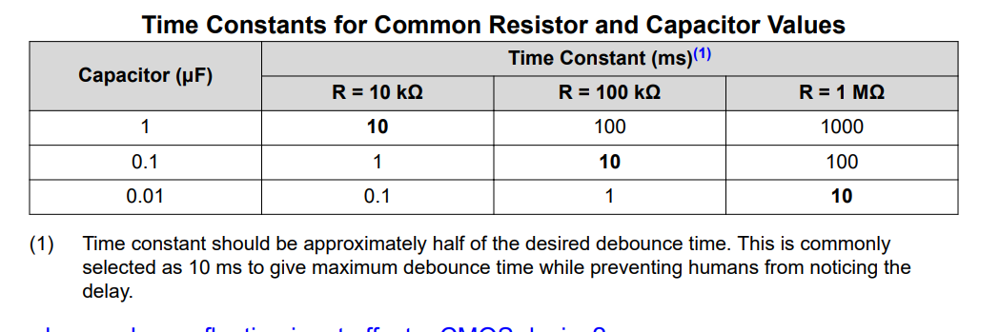
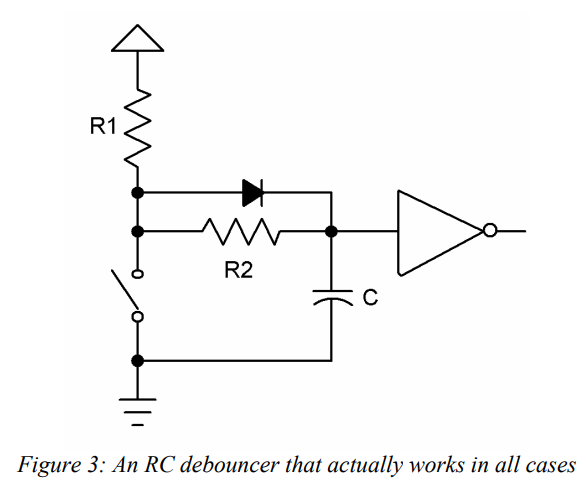

# Bibliography

tau = RC

https://www.ti.com/lit/ab/scea094/scea094.pdf?ts=1766034050027&ref_url=https%253A%252F%252Fduckduckgo.com%252F

Add a diode, so that the time constant is "R1 * C" while charging, and "R2 * C" while discharging.

There should always be a schmmit trigger. Since the voltage is exponential, the values within a logic "low" and a logic "high" are undefined when read by the GPIO pin.
Add the schmiit trigger to avoid intermmidiate values, thanks to its hysteresis.

https://my.eng.utah.edu/~cs5780/debouncing.pdf

