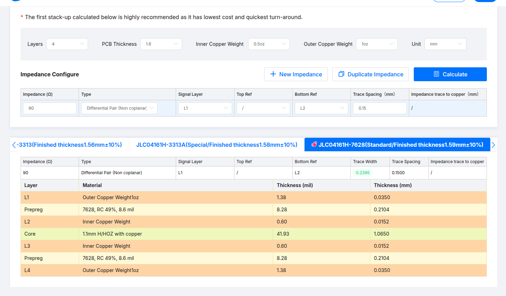

# Cotti probe

Cotti probe is a [FT4232H] based probe, compatible with JTAG/SWD/UART/SWO.

<!-- External links -->
[ft4232h]: https://ftdichip.com/products/ft4232hl/

https://digilent.com/reference/_media/jtag_hs2:jtag-hs2_rm.pdf

https://github.com/Neofoxx/JTAG-SWD-adapter

