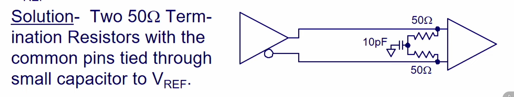
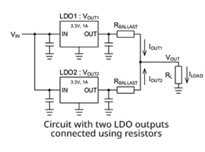
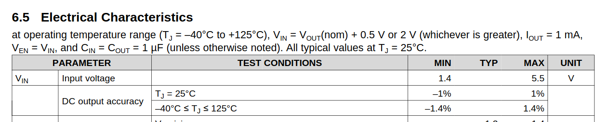
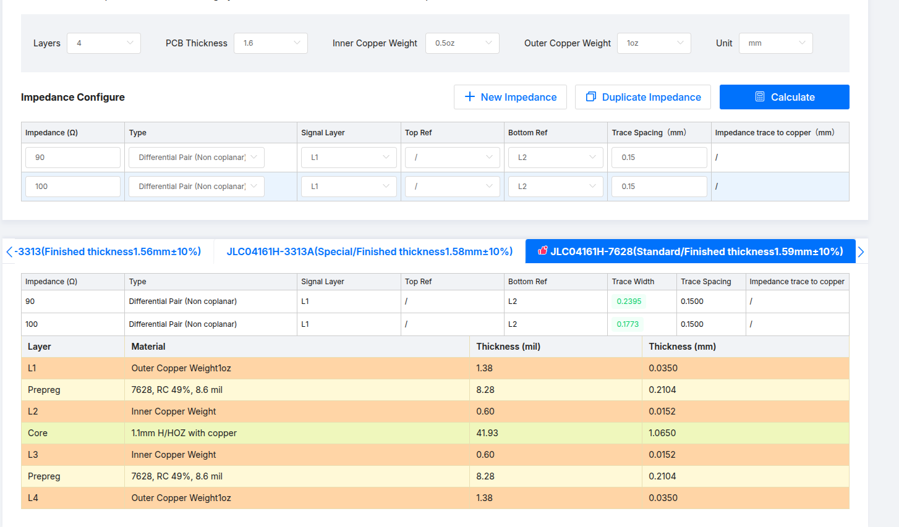

# NUC980

Documentation:

https://www.nuvoton.com/products/microprocessors/arm9-mpus/nuc980-industrial-control-iot-series/nuc980dk63yc/?group=Document&tab=2

NuMaker-IIoT-NUC980

https://www.techdesign.com/market/nuvoton/product-detail/ntc000092/numaker-iiot-nuc980?packing=No%20Packing

https://www.nuvoton.com/products/iot-solution/iot-platform/numaker-iiot-nuc980/

## Parallel LDOs

https://techweb.rohm.com/product/power-ic/dcdc/9235/

You can't connect the two LDO outputs together, because you can't guaranty that both will have exactly the same voltage value.

Following the diagram above, we can expect the middle point, after the ballast resistors, to be at the same "Vout" potential:

$$ V_{out} = V_1 - I_1 \cdot R = V_2 - I_2 \cdot R$$

$$ R = \frac{V_2 - V_1}{I_2 - I_1}$$

We go to the datasheet and find the "CD output accuracy"

We want two metrics here: 

1. Voltage range at the output.
2. Maximum current at the output.

The worst case would be:

$$V_2 = V_{0} + \Delta V $$
$$V_1 = V_{0} - \Delta V $$

$$ R = \frac{2 \cdot \Delta V}{I_2 - I_1} $$

It would be great to say: "hey make the current difference equal to 0". However, that would imply a value of "R" infinitely big.

The bigger "R", the more equal the currents are. However, the bigger the R, the bigger the voltage drop at the output.

Given a desired output current $I_{out}$, which must be greater than the maximum current of the LDO $I_{LDO}$, the difference in current must be less than the current required by the two LDOs.

For example, if LDO max current is 300 mA, and I want 500mA, then the difference must be less than 100mA, because one will be providing 300mA and the other 200mA.

$$(\Delta I = \frac{2\Delta V}{R} ) \le 2\cdot I_{max} - I_{out} $$

$$ R \ge \frac{2\Delta V}{2\cdot I_{max} - I_{out}} $$

Then:

$$ I_{out} = I_1 + I_2 = \frac{V_1 - V_{out}}{R} + \frac{V_2 - V_{out}}{R} $$

$$ I_{out} = \frac{V_0 - \Delta V - V_{out}}{R} + \frac{V_0 + \Delta V - V_{out}}{R}$$

$$ I_{out} = 2 \frac{V_0 - V_{out}}{R} $$

$$ V_0 - V_{out} = I_{out} \cdot R / 2 $$

Other design parameter is how much you desire the output voltage to swing. If the accuracy of the LDO is 1%, well maybe you can afford to lose 3% or 5%, depending on the minimum voltage required by your devices:

$$ (\Delta V_{out-actual} = I_{out} \cdot R / 2) \le \Delta V_{out} $$

Despejando "R":

$$ R \le \frac{2 \Delta V_{out}}{I_{out}}$$

Therefore:

$$\frac{2\Delta V}{2\cdot I_{max} - I_{out}} \le R \le \frac{2 \Delta V_{out}}{I_{out}} $$

And that's the design equation:

Your inputs are:

* $\Delta V_{out}$: Maximum tolerated voltage drop from the nominal voltage of the LDO at the output.
* $I_{out}$: Maximum current consumed by the load.

And then $\Delta V$ and $I_{max}$ are the precision and maximum current of the LDO as stated in the datasheet.

You always want the minimum value of "R" possible, that still satisfies the inequation.

If using:

$$ 2 * 3.3 * 0.014 / (2 * 300m - 450m) < R < 2 * 200m / 450m$$

$$ 0.616 <= R <= 0.89 $$

https://www.youtube.com/watch?v=H4nrotIVuUM

https://abracon.com/uploads/resources/Ferrite-Beads-White-Paper.pdf

